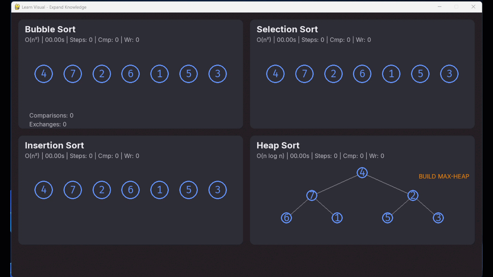

# Visual Learning Sorting

A real-time sorting algorithm visualizer built with Python and Pygame. Four algorithms — Bubble Sort, Selection Sort, Insertion Sort, and Heap Sort — race side-by-side in a 2x2 panel grid, driven by operation-weighted timing that reflects actual algorithmic cost.


## Features

- **Genuine race:** Operation timing (compare=150ms, swap=400ms) creates natural speed differences between algorithms — faster algorithms visibly finish first
- **Per-algorithm choreography:** Each sort has custom animation: Bubble Sort lift-and-swap, Insertion Sort key elevation, Selection Sort pointer arrows, Heap Sort binary tree with extraction arcs
- **Visual teaching aids:** Sorted regions turn steel-blue, active elements highlight orange, boundary markers show algorithm progress
- **Heap Sort tree layout:** Binary tree visualization with parent-child edges, sorted row grows as extractions proceed
- **Step-through mode:** Advance one operation at a time to study each algorithm move-by-move
- **Duplicate-safe:** Sprite identity tracking by unique ID (not value) handles arrays with repeated elements correctly

## Quick Start

```bash
# Requires Python 3.13+ and UV package manager
uv sync
uv run visual-sort
```

### Keyboard Controls

| Key | Action |
|-----|--------|
| Space | Play / Pause |
| Right Arrow | Step (advance one operation) |
| R | Restart (reset all panels) |
| Escape | Quit |

### Configuration

Edit `config.toml` to change the array or window preset:

```toml
[window]
preset = "desktop"    # or "tablet" (1024x768)

[sort]
# array = [3, 1, 3, 2, 1, 2, 3]   # uncomment to test duplicates
```

## Architecture

Strict MVC under `src/visualizer/`:

```
src/visualizer/
├── models/          # Algorithm generators yielding SortResult ticks
│   ├── contracts.py # SortResult dataclass, OpType enum, base class
│   ├── bubble.py    # BubbleSort (20 cmp, 26 writes)
│   ├── selection.py # SelectionSort (21 cmp, 10 writes)
│   ├── insertion.py # InsertionSort (17 cmp, 19 writes)
│   └── heap.py      # HeapSort (20 cmp, 30 writes, 35 steps)
├── views/           # Pygame rendering — sprites, overlays, layout
│   ├── sprite_manager.py  # Per-algorithm choreography + overlay classes
│   ├── sprite.py          # NumberSprite (circular ring, float coords)
│   ├── panel.py           # Panel frame + header rendering
│   ├── tree_layout.py     # Heap Sort binary tree positioning
│   ├── pointer.py         # Selection Sort i/j/min arrows
│   ├── limitline.py       # Bubble Sort boundary marker
│   ├── hud.py             # Counters + phase labels
│   └── easing.py          # Pure math (ease_in_out_quad, sine_arc)
├── controllers/
│   └── orchestrator.py    # Independent queues, operation timing, state machine
└── main.py                # Event loop, config loading, font fallback
```

Each algorithm is a Python generator yielding typed `SortResult` ticks. The controller manages independent queues per panel with integer-millisecond timing. The view layer animates sprites based on tick type with per-algorithm motion signatures.

## Testing

```bash
uv run pytest              # 345 tests (29 model + 21 easing + 185 view + 104 controller + 6 duplicate-value)
uv run ruff check src/ tests/    # lint
uv run ruff format --check src/ tests/  # format check
```

All acceptance tests (AT-01 through AT-27) pass visual verification. See `TODO/AT_READINESS_CHECKLIST.md` for the full walkthrough.

## How It Was Built — Spec-Driven AI Development

This is not a "vibe coding" project. No code was written by asking an AI to "build me a sorting visualizer." Instead, the entire application was engineered **spec-first** — 15 design documents, 81 locked decisions, and tick-level animation contracts were written before a single line of implementation existed. The AI agents then built to those specifications, and the specifications caught them when they drifted.

### The Core Problem: AI Misalignment

AI code agents don't reliably follow complex requirements. They batch operations that should be individual. They invent behavior not in the contract. They silently change counter semantics. They truncate files mid-write. Over 10 development phases, misalignment was the central engineering challenge — not "getting AI to write code," but **detecting and correcting the gap between what was specified and what was produced.**

### The Solution: Specifications as an Immune System

Every design document serves as a mechanical pass/fail gate:

- **Counter targets** (e.g., Insertion Sort must produce exactly 17 comparisons and 19 writes for `[4, 7, 2, 6, 1, 5, 3]`) — catch silent logic drift immediately
- **81 locked decisions** (`DECISIONS.md`) — resolve ambiguity before the agent encounters it, eliminating the judgment calls where models hallucinate
- **Tick-level contracts** — prescribe the exact sequence of operations (compare, shift, placement) so "working code that sorts correctly" isn't sufficient; it must sort correctly *in the right sequence of steps*
- **27 acceptance tests** with human-verifiable visual criteria — catch rendering misalignment that unit tests can't reach

### Two-Agent Workflow

The spec-first approach led naturally to separating two concerns:

1. **Cowork (Opus)** — Reads specifications, designs prompts with exact code paths and exit gates, makes judgment calls about architectural trade-offs
2. **Claude Code (Sonnet/Opus)** — Executes prompts mechanically, runs lint/format/test gates, reports pass/fail without interpretation

This separation exists because *judgment and execution are different failure modes*. When the same model does both, it rationalizes its own mistakes. When execution is mechanical and gates are objective, misalignment becomes visible.

### What's Documented

| Resource | What it shows |
|----------|--------------|
| [`docs/design_docs/`](docs/design_docs/) | 15 specification documents — the authority the code was built against |
| [`docs/prompts/`](docs/prompts/) | The exact prompts fed to Claude Code, showing how specs became instructions |
| [`docs/devlog/`](docs/devlog/) | Session journal — includes every misalignment incident and correction |
| [`docs/AI_Conversations/`](docs/AI_Conversations/) | Review sessions, gap analysis, agent trap identification |
| [`CLAUDE.md`](CLAUDE.md) | Agent context file — critical rules, counter targets, architecture summary |

### Key Takeaways

**For hiring managers:** This demonstrates that AI-assisted development requires the same engineering rigor as traditional development — more, actually, because the failure modes are less predictable. The specs, tests, and decision logs are the engineering artifact; the code is the output.

**For AI-assisted development learners:** Write your specs first. Make them testable. When the AI drifts (it will), the spec tells you *what* drifted and *how far*. Without specs, you can't distinguish "works" from "works correctly." The four-step prompt pattern (pre-action log → implementation → gates → post-action log) creates an audit trail that makes misalignment visible after the fact.

## Tech Stack

Python 3.13+ | Pygame 2.5+ | UV package manager | Hatchling build system | Ruff (lint + format) | Pytest

## License

MIT License. See [LICENSE](LICENSE).
